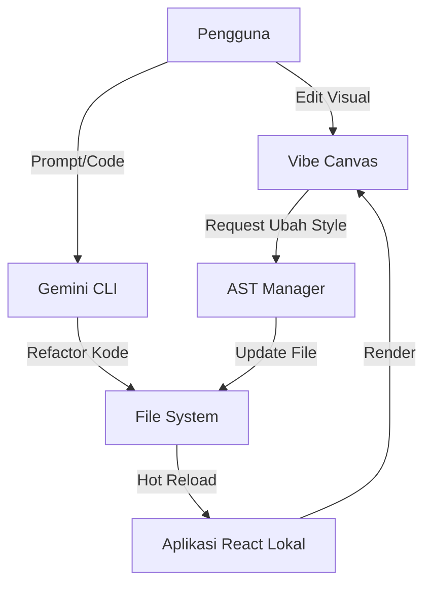

# Spesifikasi Arsitektur: Vibe Editor (The Bridge)

## 1. Tinjauan Umum
Dokumen ini merangkum hasil riset mengenai alat jembatan dua arah antara desain (Canvas) dan kode (Vibecoding). Sistem ini, disebut **Vibe Editor**, bertujuan untuk menyatukan alur kerja desainer dan pengembang dengan memanfaatkan AI (Gemini) dan pemrosesan AST.

## 2. Alur Kerja Pengguna (User Workflow)

### Kasus 1: Desain ke Kode (Stitch-First)
1.  **Inisiasi**: Pengguna membuat desain visual menggunakan **Google Stitch**.
2.  **Generasi Kode**: Stitch menghasilkan kode React/HTML.
3.  **Vibe Editor**: Kode dimuat ke dalam Vibe Editor untuk penyesuaian manual atau refactoring logika menggunakan Gemini CLI.
4.  **Hasil**: Aplikasi React yang fungsional dan sesuai desain awal.

### Kasus 2: Kode ke Desain (Code-First)
1.  **Vibecoding**: Pengguna menulis kode atau menggunakan Gemini CLI untuk membangun fitur di terminal.
2.  **Vibe Editor (Visual)**: Pengguna membuka Vibe Editor yang me-render aplikasi lokal.
    *   Pengguna melakukan penyesuaian visual (drag-and-drop, resize, ubah warna) pada komponen yang sudah ada.
3.  **Pembaruan Kode**: Vibe Editor "menyuntikkan" perubahan visual tersebut kembali ke file sumber (`.tsx`/`.jsx`) secara otomatis tanpa merusak logika yang ada.

## 3. Arsitektur Teknis

### 3.1 Komponen Utama
Sistem terdiri dari tiga pilar utama:

1.  **Backend (The Vibe Engine)**
    *   **Gemini CLI**: Menangani operasi logika kompleks, refactoring kode, dan pemahaman konteks proyek.
    *   **AST Manager (Node.js Service)**: Layanan lokal yang bertanggung jawab untuk mem-parsing kode menjadi *Abstract Syntax Tree* (AST), memodifikasi node spesifik (misal: mengubah prop `className`), dan menulis ulang file. Teknologi: `jscodeshift` atau `react-ast`.

2.  **Frontend (The Vibe Canvas)**
    *   **Visual Overlay**: Lapisan antarmuka yang berada di atas aplikasi pengguna (iframe).
    *   **Fitur**: Seleksi elemen (DOM inspection), panel properti (Style editor), dan manipulasi langsung (Drag & Drop menggunakan library seperti `react-moveable` atau `dnd-kit`).

3.  **Bridge (Penghubung)**
    *   Protokol komunikasi antara Visual Overlay dan AST Manager.
    *   Menjamin sinkronisasi dua arah secara real-time.

### 3.2 Diagram Alir Data

## 4. Rencana Implementasi (Roadmap)

### Fase 1: Prototipe (Proof of Concept)
- [ ] Setup proyek Next.js sederhana sebagai target.
- [ ] Buat skrip AST sederhana untuk mengubah style/class.
- [ ] Buat UI Overlay minimalis yang bisa memilih elemen.

### Fase 2: Integrasi Dasar
- [ ] Hubungkan UI Overlay dengan skrip AST.
- [ ] Implementasi fitur "Klik untuk Edit Text".
- [ ] Implementasi fitur "Ganti Warna Background".

### Fase 3: Integrasi AI
- [ ] Tambahkan "AI Prompt Box" di Canvas.
- [ ] Hubungkan Prompt Box ke Gemini CLI untuk perubahan kompleks.

## 5. Referensi Teknologi
*   **Visual Editing**: Konsep mirip dengan *Onlook* atau *Storybook*.
*   **Code Transformation**: Menggunakan *Babel* atau *jscodeshift*.
*   **AI**: Google Gemini 2.5/3.0 via Gemini CLI.
