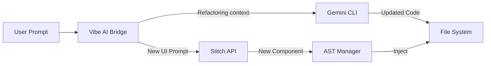

# Technical Design: Gemini Integration Strategy

## 1. Tujuan
Menentukan bagaimana **Gemini** (melalui CLI atau API) dan **Stitch** berinteraksi dengan **Vibe Editor** untuk menangani perubahan kode yang kompleks (Refactoring, Logic generation, UI generation) yang tidak bisa ditangani oleh AST Manager sederhana.

## 2. Peran AI dalam Vibe Editor

Kami membagi peran AI menjadi dua kategori:

| Kategori | Deskripsi | Handle Oleh | Contoh Prompt |
| :--- | :--- | :--- | :--- |
| **Logic & Refactor** | Mengubah struktur kode yang ada, logika, atau memecah komponen. | **Gemini CLI** | "Extract this JSX into a separate `Card` component" |
| **Generative UI** | Membuat layar baru atau bagian UI dari nol. | **Stitch API** | "Create a settings screen with dark mode toggle" |

## 3. Alur Kerja Integrasi (The AI Bridge)

### 3.1 Skenario: "Refactor with AI" (Gemini CLI)
1.  **Seleksi**: Pengguna memilih sebuah `div` container di Vibe Canvas.
2.  **Prompt**: Pengguna mengetik di Prompt Box: *"Ubah ini jadi komponen Card dan tambahkan prop title"*.
3.  **Context Assembly**: Vibe Editor mengumpulkan konteks:
    *   Kode komponen saat ini (misal: `Dashboard.tsx`).
    *   Lokasi seleksi (Baris 50-80).
4.  **Eksekusi**:
    *   Vibe Editor memanggil Gemini CLI (via `exec` atau API).
    *   Prompt: *"Refactor the code snippet at line 50-80 in Dashboard.tsx. Requirements: [User Prompt]. Output: The updated Dashboard.tsx content only."*
5.  **Apply**: Vibe Editor menerima kode baru dan me-replace file asli.

### 3.2 Skenario: "Generate New Section" (Stitch)
1.  **Action**: Pengguna men-drag "AI Placeholder" ke Canvas.
2.  **Prompt**: *"Buat tabel data pengguna di sini"*.
3.  **Eksekusi**:
    *   Vibe Editor memanggil **Stitch API** (`generate_screen_from_text` atau varian komponen).
    *   Stitch mengembalikan kode JSX/HTML.
4.  **Integrasi**:
    *   Vibe Editor menggunakan **AST Manager** untuk menyuntikkan kode baru tersebut ke dalam Placeholder di file sumber.

## 4. Tantangan & Solusi

### 4.1 Konteks yang Hilang
*   *Masalah*: AI mungkin menghilangkan import yang diperlukan atau merusak style global.
*   *Solusi*: Gunakan **Gemini 1.5 Pro/Flash** dengan window konteks besar. Kirimkan seluruh file, bukan hanya snippet, atau gunakan fitur *Smart Context* dari Gemini CLI untuk membaca file terkait (`tailwind.config.js`, `global.css`).

### 4.2 Deterministik Output
*   *Masalah*: Output AI bisa bervariasi (chatty).
*   *Solusi*:
    *   Gunakan instruksi sistem yang ketat: *"Return ONLY the raw code. No markdown formatting. No explanation."*
    *   Validasi output menggunakan linter sebelum menulis ke file.

## 5. Ringkasan Arsitektur AI

